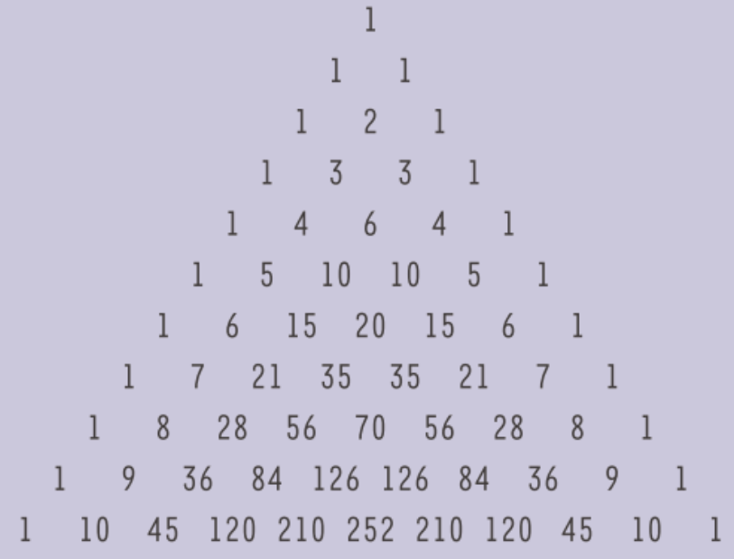

### Opdracht
Definiëer een functie *piramide_driehoek_pascal(n)* die de eerste n rijen van de driehoek van Pascal in een piramidevorm print. Dat wil zeggen: mooi symmetrisch met gelijke afstanden tussen de elementen. Dit is niet zo eenvoudig als het lijkt, want in de lagere rijen bestaan de getallen uit 2, 3 of meer cijfers.

Maak gebruik van je functie *rij_driehoek_pascal(n,p)*.

**Opmerking:** er is geen automatische verbetering voor deze opdracht. Probeer de piramidevorm uit de afbeelding zo goed mogelijk te benaderen.

**Invoer:**

    >>>piramide_driehoek_pascal(10)

**Uitvoer:**

{height=50}

