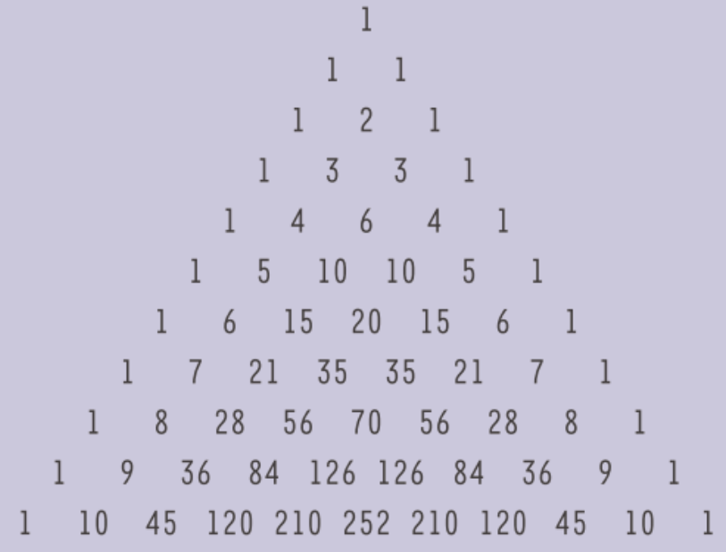

De driehoek van Pascal (*kansrekenen hoofdstuk 2.1*) wordt gevormd door ee schikking van combinaties.

- De *nulde* rij bevat enkel $$C_0^0$$ *(=1)*.
- De eerste rij bevat $$C_1^0$$*(=1)* en $$C_1^1$$*(=1)*. 
- De tweede rij bevat $$C_2^0$$*(=1)*, $$C_2^1$$*(=2)* en $$C_2^2$$*(=1)*.

Als je al deze combinaties uitrekent, verkrijg je het volgende patroon:

{height=50}

### Opdracht
Definiëer een functie *rij_driehoek_pascal(n)* die de elementen van de n-de rij in een lijst teruggeeft.

Maak gebruik van je functie *combinatie(n,p)*

**Invoer:**

    >>>rij_driehoek_pascal(2)

**Uitvoer:**

    [1,2,1]

