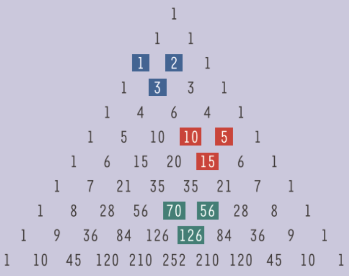

In de driehoek van Pascal zijn een aantal merkwaardige patronen te vinden. Zo is er bijvoorbeeld de formule van **Stifel-Pascal**, die zegt dat elke combinatie $$C_n^p$$ kan berekend worden door de som van de twee combinaties in de rij erboven te nemen (*kansrekenen hoofdstuk 2.1*). Op deze afbeelding zijn een aantal voorbeelden aangeduid. *De formule zelf geven we hier niet, dit is een onderdeel van de opdracht.*

{height=50}

### Opdracht
Het verband van *Stifel-Pascal* biedt ons een manier om combinaties **recursief** te berekenen. *Zie uitleg over recursie bij 'faculteit recursief'.*

Definier een functie¨*combinatie_recursief(n,p)* die de combinaties recursief uitrekent via dit verband. Je mag dus nergens een faculteit gebruiken.

**Invoer:**

    >>>combinatie_recursief(7,2)

**Uitvoer:**

    21

